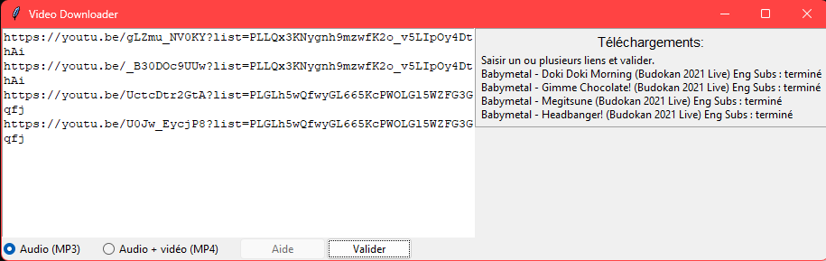

# Auto-download videos
Un outil qui permet de télécharger des vidéos YouTube au format MP3 ou MP4.

## Lancement de l'application

### CLI
- Installez la librairie [PyTube](https://pytube.io/en/latest/)
- Utilisez la commande `python main.py` dans le dossier `src`
